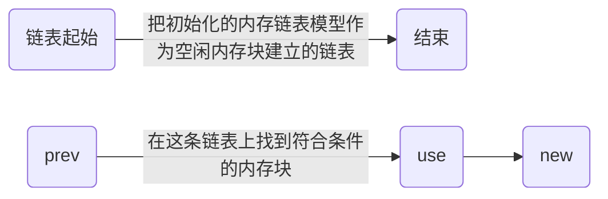
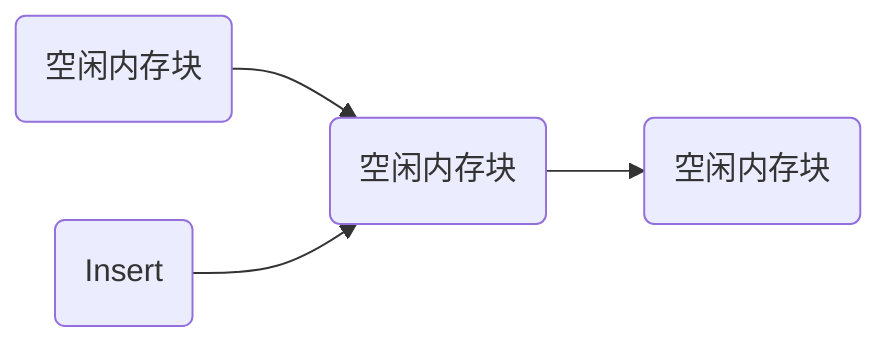
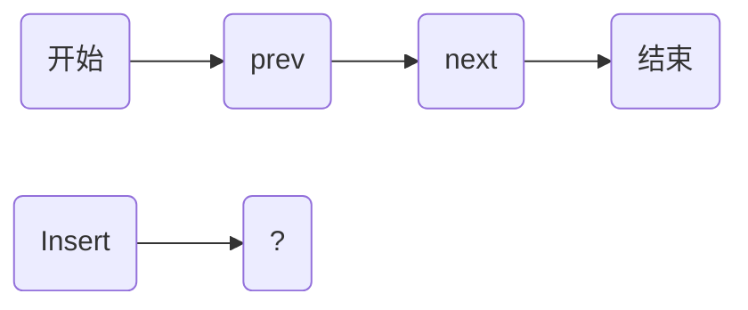
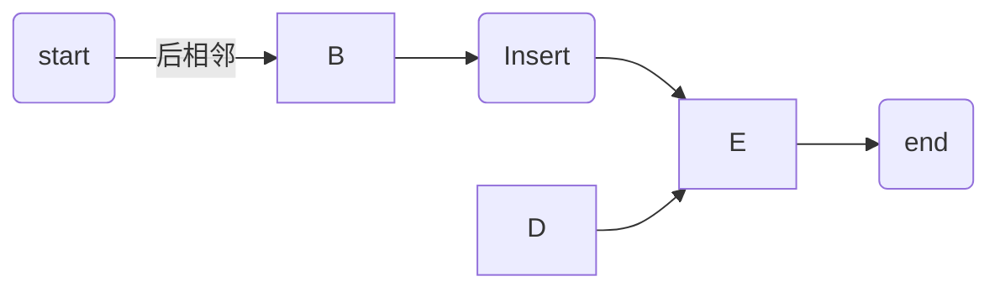
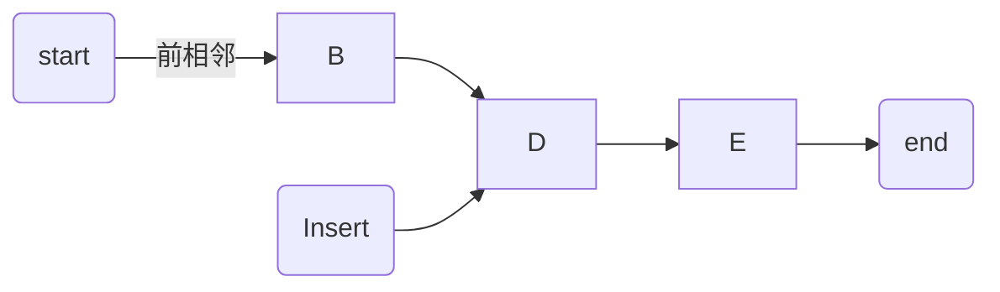

# 内存管理

## 引言

内存是一种硬件资源，通常需要使用复杂的算法进行管理。

由于我们实现的是实时操作系统，考虑到断页带来的实时性影响，因此不打算支持虚拟内存。实际上，大部分MCU上也根本没有MMU。换而言之，我们管理的是物理内存。

### C语言指针

先简单复习一下指针：

指针的本质是要求值必须为地址的变量。

int a,代表在内存中开辟一片空间，空间存放a的值。int *a，代表在内存中开辟一片空间，空间存放a的值，只不过此时a的值是一个地址，可以通过这个值找到另一块内存空间。

当我们进行 int *a = malloc(sizeof(xxx))的操作时，实际上就是改变这片空间存储的值。此时a就是一个有意义的值，它代表一个存在且可以被存放的内存空间的地址。

那么，当我们随机定义一个指针并且要对这片内存操作时，会发生什么呢？例如：

```text
int *a;
*a = 1;
```

当我们定义指针a时，a的值是随机的，那么我们解引用a，计算机找不到这片空间，此时错误就会发生了。

也就是说，如果我们要手动管理内存，那么必须要分配空闲的内存地址，必须对内存进行严格的管理。

### C语言malloc

在标准C语言库中，有malloc这些库函数可供使用，但是，我们打算实现一个类似malloc的内存机制。但是c语言标准库的malloc放在RTOS中是相当危险的，因为它并没有针对实时性进行优化，可能会发生以下危险：

1.执行时间不固定。

2.内存本身就是一种公共资源，库函数的malloc并没有并发管理机制。

所以，为RTOS设计一个内存管理算法是有必要的。

### 内存管理算法

简要介绍一下两种内存管理算法：

### 小内存管理算法

小内存管理算法，通常也称为内存分配器，用于在内存资源有限的嵌入式系统中高效地管理内存。这些算法的目标是减少内存碎片，提高内存利用率，并确保分配和释放内存的操作尽可能快速、稳定。

它采用不断分割的方法对内存进行动态分配，分为初始化，分割，释放三个步骤，为了简洁起见，笔者直接放图：

#### 初始化与申请


这是整体思想，通过对初始内存块的不断切割，最终形成了各个不同的内存块。

#### 初始化


在初始化后，空闲内存块已经形成了一条链表，这条链表被称为空闲内存块链表，**内存块被使用就被踢出这条链表，被释放就加入这条链表**，如果内存块大于要申请的大小，就把多余的部分切割，然后加入这条内存链表。

malloc会找到合适的内存块，并且返回它的地址。


#### 申请malloc




这条链表上就是空闲内存块链表，内存块被使用就被踢出这条链表，被释放就加入这条链表，如果内存块大于要申请的大小，就把多余的部分切割，然后加入这条内存链表。

最终读者会看到，空闲内存块会越来越小，而且也越来越不连续。

虽然通过指针，通常情况下我们可以把不连续的空间当成连续的空间使用，这些不连续的空间被称为碎片。但是，

当不连续的空间越来越小时，我们很可能找不到一个足够大的空间碎片满足存储请求，尽管总的空闲空间可能仍然满足。

这样下去，系统绝对是会崩溃的。


为了避免碎片问题，也有一些方法被广泛采用。

#### 分配时的策略

为了减少碎片，通常有两种策略：best-fit和first-fit。

**best-fit算法**：这个策略趋向于将大的碎片保留下来满足后续的请求。我们根据空闲空间块的大小，将它们分在若干个容器中，在容器中，存储块按照他们的大小进行排列，这使得寻找best-fit块变得更加容易。

**first-fit算法** ：在这个策略中，对象被放置在地址最低的、能够容纳对象的碎片中。这种策略的优点是速度快，但是内存分配性能比较差。


### **free释放**

释放内存块，就是将内存块加入空闲内存块表。同时会有一些方法减少碎片。

### **合并内存块**

同时，如果我们检测到free释放的内存块的地址与其他空闲内存块是连续的，我们会合并它们：

#### 释放



直接插入即可。


#### 合并内存块




内存块后相邻：



合并后等价于：


内存块前相邻：



合并后等价于：


前后都相邻：


合并后等价于：


共有三种情况：前相邻、后相邻、前后都相邻。

如果前后相邻是相互独立的，那么互不影响，如果不独立，通过后，前的顺序可以得到前后都相邻的结果，因此该顺序正确。

所以程序中，我们先进行后相邻合并判断，再进行前相邻合并判断。


## 内存从何而来？

要回答这个问题，我们必须思考程序的执行过程。

**内存模型**

elf文件是一种常见的文件格式，常见的elf文件内存模型如下：

```text
  +-----------------------+
  |       栈段 (Stack)     |
  | (局部变量、函数调用帧)  |
  +-----------------------+
  |       堆段 (Heap)      |
  | (动态分配的内存)       |
  +-----------------------+
  | 未初始化数据段 (BSS)   |
  | (未初始化的全局和静态变量)|
  +-----------------------+
  | 已初始化数据段 (Data)  |
  | (已初始化的全局和静态变量)|
  +-----------------------+
  |       只读数据段      |
  |   (常量字符串、只读变量)|
  +-----------------------+
  |       代码段 (Text)   |
  | (程序指令、常量等)     |
  +-----------------------+

```

中间的几个数据段区域通常也被称之为静态区。

### 内存段

静态区：如果程序的某些数据结构对象的大小可以在编译时刻知道，它们就可以被放在静态区。通常包括全局变量和编译器产生的数据。

堆：这个区是动态的，向高地址方向增长，它的大小会随着程序运行而改变。我们在c语言标准库中使用的malloc和free获取和释放的存储块就属于堆。

#### 栈

栈：动态，向低地址方向增长，一个过程调用发生时记录有关机器状态的信息（例如程序计数器和机器寄存器的值）一般会被分配到栈中。

局部变量的作用区域就是函数块，因此局部变量依赖的内存并不是堆，而是栈，在栈中分配内存用于运算局部变量。

### 字节对齐

字节对齐：数据结构的存储布局受目标机的寻址约束影响很大，有时候会要求字节对齐，例如把一些数据放在能够被8整除的地址上，字节对齐产生的闲置空间称为补白。

#### 静态与动态

静态和动态分别表示编译时刻和运行时刻，静态存储分布指：通过程序文本即可确定存储分配大小。动态存储分布指：只有在程序运行过程中才能做出决定。

静态内存优点是稳定，但是需要考虑设备内存上限；动态内存优点是内存利用率高，但是不稳定。

编译器一般使用下列两种策略进行动态存储分布：栈式存储和堆存储。

栈式存储：支持过程的局部在栈中分布空间，通常被用作过程返回和调用。

堆存储：存放某些生命周期长的数据，这些数据通常被放在堆中。
很多语言把方法（函数）作为用户自定义动作的单元，在方法（任务）运行时，编译器会把这些语言运行时刻的存储按照一个栈进行管理，栈是内存中的一部分，用来存储函数调用和局部变量的内存区域，它在程序执行时被动态分配和管理。

#### 堆管理
我们在C++或java里new的一个对象就属于堆，分配和回收堆区空间的子系统被称之为存储管理器，它是应用程序和操作系统之间一个很重要的接口，对于c和c++这种不安全的语言，存储管理器还负责实现空间回收。

程序执行时，堆区会被分割为一块块存储空间和已用存储块，但是空闲存储空间不一定连续，很多操作系统在处理不连续的空间时，都使用了映射的思想，比如页表，哈希等等。

通过一个指针数组，通常情况下我们可以把不连续的空间当成连续的空间使用，这些不连续的空间被称为碎片。但是当不连续的空间越来越小时，我们很可能找不到一个足够大的空间碎片满足存储请求，尽管总的空闲空间可能仍然满足。


### 获得内存的两种策略

### 堆

在程序被编译和链接时，编译器会自动分配堆的大小，而C语言标准库又是从堆中获取内存的，因此，我们可以考虑在链接脚本（或启动文件）中修改堆的大小，这样就能获得可支配的内存。


### 静态数组

我们注意到静态区会存放静态变量，也就是说，通过在程序中声明静态变量的方法，也可以获得内存空间，因此，第二种策略就是：

声明较大的静态数组，对静态数组的内存空间进行管理。


## Linux内核中的slab分配器

预留，这些以后再补充。


# 代码实现


### 结构体

```

Class(heap_node){
        heap_node *next;
        size_t BlockSize;
};

Class(xheap){
        heap_node head;
        heap_node *tail;
        size_t AllSize;
};

```

为了创建一条链表，我们需要两个结构体：头部和节点。其中头部会记录链表的第一个节点和最后一个节点。


### 全局变量

```
xheap TheHeap = {
        .tail = NULL,
        .AllSize = config_heap,
};
```

这是声明的头节点，方便管理链表。

```
static  uint8_t AllHeap[config_heap];

```

这就是全局数组，我们要管理的内存就是该数组。

```
static const size_t HeapStructSize = (sizeof(heap_node) + (size_t)(alignment_byte)) &~(alignment_byte);
```

头节点的结构体大小。

### 宏定义

```
#define MIN_size     ((size_t) (HeapStructSize << 1))
```

为了避免碎片问题，我们设置分配的最小大小为节点结构体的两倍。

### 初始化

```

void heap_init( void )
{
    heap_node *first_node;
    uint32_t start_heap ,end_heap;
    start_heap =(uint32_t) AllHeap;
    if( (start_heap & alignment_byte) != 0){
        start_heap += alignment_byte ;
        start_heap &= ~alignment_byte;
        TheHeap.AllSize -=  (size_t)(start_heap - (uint32_t)AllHeap);
    }
    TheHeap.head.next = (heap_node *)start_heap;
    TheHeap.head.BlockSize = (size_t)0;
    end_heap = start_heap + (uint32_t)TheHeap.AllSize - (uint32_t)HeapStructSize;
    if( (end_heap & alignment_byte) != 0){
        end_heap &= ~alignment_byte;
        TheHeap.AllSize =  (size_t)(end_heap - start_heap );
    }
    TheHeap.tail = (heap_node *)end_heap;
    TheHeap.tail->BlockSize  = 0;
    TheHeap.tail->next =NULL;
    first_node = (heap_node *)start_heap;
    first_node->next = TheHeap.tail;
    first_node->BlockSize = TheHeap.AllSize;
}

```

1.判断数组首地址是否字节对齐，如果不是，则进行调整。

2.设置头节点的第一个内存块节点的地址。

3.计算尾节点的地址并进行字节对齐判断，然后设置尾节点的内存地址。

4.设置第一个节点的地址为数组起始地址并指向下一个节点为尾节点。

简单来说，就是我们要在大内存数组起始地址和终结地址分别创建两个heap_node节点，用于管理这个内存块,然后将它们使用指针连起来。


像&= ~这些操作是字节对齐，字节对齐可以提高CPU运行速度，也可以防止error的发生。

CPU会根据数据类型的不同，访问时取不同的连续的字节数，未对齐的数据类型可能会导致灾难的发生（不过编译器通常会帮助我们优化这些工作，例如数据类型转换、字节对齐等等）

Sparrow中最大的数据类型是uint_32，也就是4字节，但是是考虑浮点数，还是采用八字节对齐。

另外还要给读者介绍一点小知识：**对于正整数X，Y = 2^n , X%Y 可以被 X&(Y-1) 代替**。

举个例子，X % 4 = X &3。

证明过程不难理解：

我们都知道二进制左移一位代表乘以2倍，那么对于2^n，X中比n位高的位的都是2^n的倍数，所以 X%(2^n)的结果必然是X低n位的值。既然我们需要低n位的值，那么直接X&(2^n-1)就可以得到X低n位的值了。

### 分配

```
void *heap_malloc(size_t WantSize)
{
    heap_node *prev_node;
    heap_node *use_node;
    heap_node *new_node;
    size_t alignment_require_size;
    void *xReturn = NULL;
    WantSize += HeapStructSize;
    if((WantSize & alignment_byte) != 0x00) {
        alignment_require_size = (alignment_byte + 1) - (WantSize & alignment_byte);//must 8-byte alignment
        WantSize += alignment_require_size;
    }
    if(TheHeap.tail== NULL ) {
        heap_init();
    }
    prev_node = &TheHeap.head;
    use_node = TheHeap.head.next;
    while((use_node->BlockSize) < WantSize) {//check the size is fit
        prev_node = use_node;
        use_node = use_node->next;
        if(use_node == NULL){
            return xReturn;
        }
    }
    xReturn = (void*)( ( (uint8_t*)use_node ) + HeapStructSize );
    prev_node->next = use_node->next ;
    if( (use_node->BlockSize - WantSize) > MIN_size ) {
        new_node = (void *) (((uint8_t *) use_node) + WantSize);
        new_node->BlockSize = use_node->BlockSize - WantSize;
        use_node->BlockSize = WantSize;
        new_node->next = prev_node->next;
        prev_node->next = new_node;
    }
    TheHeap.AllSize-= use_node->BlockSize;
    use_node->next = NULL;
    return xReturn;
}

```

1.首先，我们需要对传进来的内存块申请大小进行判断，如果大小不是字节对齐的，那么需要我们进行调整。

2.判断是不是第一次申请，如果是，就进行初始化。

3.从第一个链表节点开始遍历，直到找到符合大小的节点。

4.如果符合大小的节点内存块大于要申请的大小，那么裁剪该内存块节点。

5.更新总内存块大小并返回。


## 释放

```
void heap_free(void *xReturn)
{
    heap_node *xlink;
    uint8_t *xFree = (uint8_t*)xReturn;

    xFree -= HeapStructSize;//get the start address of the heap struct
    xlink = (void*)xFree;
    TheHeap.AllSize += xlink->BlockSize;
    InsertFreeBlock((heap_node*)xlink);
}
```

1.更新内存块大小并进行插入操作


### 插入与合并

```
static void InsertFreeBlock(heap_node* xInsertBlock)
{
    heap_node *first_fit_node;
    uint8_t* getaddr;

    for(first_fit_node = &TheHeap.head;first_fit_node->next < xInsertBlock;first_fit_node = first_fit_node->next)
    { /*finding the fit node*/ }

    xInsertBlock->next = first_fit_node->next;
    first_fit_node->next = xInsertBlock;

    getaddr = (uint8_t*)xInsertBlock;
    if((getaddr + xInsertBlock->BlockSize) == (uint8_t*)(xInsertBlock->next)) {
        if (xInsertBlock->next != TheHeap.tail) {
            xInsertBlock->BlockSize += xInsertBlock->next->BlockSize;
            xInsertBlock->next = xInsertBlock->next->next;
        } else {
            xInsertBlock->next = TheHeap.tail;
        }
    }
    getaddr = (uint8_t*)first_fit_node;
    if((getaddr + first_fit_node->BlockSize) == (uint8_t*) xInsertBlock) {
        first_fit_node->BlockSize += xInsertBlock->BlockSize;
        first_fit_node->next = xInsertBlock->next;
    }
}
```

1.链表节点的遍历从低地址到高地址,判断下一个节点的地址是不是比插入的节点地址高, 如果是, 说明要插入节点的实际地址就是在下一个遍历到的节点的前面.

2.更新插入内存节点与高地址的内存节点的指向

3.判断地址是不是后相邻,如果是,执行合并

4.判断地址是不是前相邻,如果是,执行合并


## 小结

介绍了内存分配的原理与内核中的代码实现
