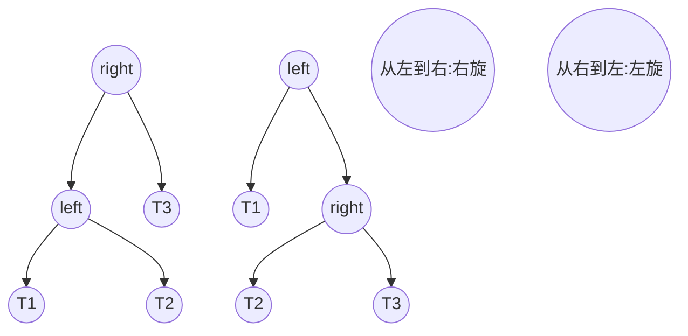

## 前言

红黑树是一种被广泛使用的数据结构，这篇文章主要讲讲红黑树的实现以及具体的实现代码（C语言版本）。

红黑树遵循原则如下：

1.节点为红色或者黑色

2.根节点为黑色

3.空叶子节点为黑色

4.红色节点的子节点必须为黑色

5.从根节点到空叶子节点的每条路径上的黑色节点数量相同

### 旋转



假设我们要进行左旋，节点关系改变：

1.left的右节点变为right的左节点

2.right的左节点变为left节点

现在考虑再父节点：

1.right的父节点变为left的父节点

2.如果right现在是根节点，那么更新根节点

3.如果right不是根节点，那么更新left的父节点的子节点

因此我们得到以下代码：

```
	struct rb_node *right = node->rb_right;

    node->rb_right = right->rb_left;
    if(node->rb_right != NULL){
        right->rb_left->rb_parent = node;
    }
    right->rb_left = node;

    right->rb_parent = node->rb_parent;
    if(right->rb_parent != NULL){
        if(node == node->rb_parent->rb_left){
            node->rb_parent->rb_left = right;
        }else{
            node->rb_parent->rb_right = right;
        }
    }else{
        root->rb_node = right;
    }

    node->rb_parent = right;
```

右旋操作同理，笔者就不过多演示了,代码如下：

```
	struct rb_node *left = node->rb_left; 
    node->rb_left = left->rb_right;
    if(node->rb_left != NULL) {
        left->rb_right->rb_parent = node;
    }
    left->rb_right = node;
    
    left->rb_parent = node->rb_parent;
    if(left->rb_parent != NULL)
    {
        if (node == node->rb_parent->rb_right) {
            node->rb_parent->rb_right = left;
        }else {
            node->rb_parent->rb_left = left;
        }
    }else {
        root->rb_node = left;
    }
    
    node->rb_parent = left;

```

### 插入

红黑树新插入的节点初始为红色，进行插入后共有五种情况：

1.无父节点：该树为空，插入第一个节点，把节点染成黑色

2.有父节点：父节点为黑色，满足规则，不需要进行更改

3.父节点为红色，叔叔节点为红色，此时需要先将父亲节点和叔叔节点染成黑色，再将祖父节点染红，然后递归向上维护G节点，直到被转化为情况4

4.父节点为红色，叔叔节点为黑色

​	4.1插入节点为右节点，先对父节点进行左旋，转化为4.2情况

​	4.2插入节点为左节点，此时将父节点染为黑色，祖父节点染红，再进行祖父节点的右旋

​	

值得一提的是，情况三是可能会将根节点染红的，此时违背了红黑树的性质，因此我们可能需要将根节点染黑，但是这与情况1的数据流是重合的，因此我们可以考虑调整控制流。

控制流如图：

首先，情况2无影响。

假设插入后为情况1：


假设插入后为情况4.2：


假设插入后为情况4.1：


假设插入后为情况三，

如果转换后是情况4.2，有：


还有：


此时我们发现，这一条控制流包括了所有的控制流，我们可以考虑在该基础上实现代码。

笔者只展示程序的数据流，且部分用注释说明，控制流部分太连续的，不适合分段说明，读者看图应该就知道控制流如何实现了。

先进行插入操作：

```
	node->rb_parent = parent;
    node->rb_color = RB_RED;
    node->rb_left = node->rb_right = NULL;

    *rb_link = node;
```

对于第一种情况有：

```
root->rb_node->rb_color = RB_BLACK;
```

第二种情况，什么都不做即可。


先假设父节点为祖父节点的左子节点：

第三种情况：

```
uncle->rb_color = RB_BLACK; 
parent->rb_color = RB_BLACK; 
gparent->rb_color = RB_RED; 
node = gparent;
//递归向上维护
```

第四种情况，将其进行转换为第五种情况，此时数据流可以复用：

```
//父节点进行左旋
struct rb_node *tmp = parent; 
parent = node; 
node = tmp;
```

第五种情况：

```
parent->rb_color = RB_BLACK; 
gparent->rb_color = RB_RED; 
//祖父节点右旋
```

以上就是插入情况，父节点为祖父节点的右节点同理，就不过多展示了，接下来看看删除情况。


### 删除

删除包括删除操作和颜色的维护，先讲删除操作。

其实就两个步骤：

1.使用BST（二叉搜索树）的规则删除节点

2.维护节点颜色，进行重新上色操作

### 删除操作

我们先使用标准二叉树的规则删除该节点，可能有读者记不清二叉搜索树的删除规则了，没关系，我也记不清了：

**删除叶子节点**（即没有子节点的节点）：

- 直接删除节点，并将其父节点的指针设置为 `NULL`。

**删除只有一个子节点的节点**：

- 将子节点提升为被删除节点的位置。具体来说，如果被删除节点有左子节点，那么左子节点成为被删除节点的位置；反之亦然。

**删除有两个子节点的节点**：

- 找到被删除节点的前驱节点（左子树中最大的节点）或后继节点（右子树中最小的节点）。通常选择后者。
- 将被删除节点的值与前驱或后继节点的值交换。
- 删除前驱或后继节点（即删除一个只有一个或没有子节点的节点）。

举例：

删除下列节点中的20节点前：

        20(B)
        /   \
     10(B) 40(R)
           /   \
         30(B) 50(B)
        /		  \
       25(R)	  60(R)

删除后：

        25(B)
        /   \
     10(B) 40(R)
           /    \
         30(B) 50(B)
         		   \
         		   60(R)

给出代码：

```
		struct rb_node *left;
        struct rb_node *old = node;

		//寻找可替代节点，通常是后继节点
        node = node->rb_right;
        while ((left = node->rb_left) != NULL) {
            node = left;
        }

        child = node->rb_right;
        parent = node->rb_parent;
        color = node->rb_color;

        //维护父子节点关系

        if (node->rb_parent == old) {
            parent = node;
        }
        node->rb_parent = old->rb_parent;
        node->rb_color = old->rb_color;
        node->rb_right = old->rb_right;
        node->rb_left = old->rb_left;
```


## 上色操作

经过BSD删除操作后，如果删除的是红色节点，那么不会影响树高，直接删除即可，不需要上色。

删除黑色节点后，我们需要考虑该替换节点之前的兄弟节点：

1.兄弟节点是红色：旋转兄弟节点后重新为兄弟节点和父节点上色

2.兄弟节点是黑色：

​	2.1 兄弟节点的子节点都是黑色：重新上色兄弟节点并向上递归染黑解决黑色节点补偿问题。

​	2.2 至少有一个兄弟节点的子节点是红色：

​		2.2.1 如果兄弟节点的近端子节点是红色：旋转兄弟节点和子节点，再按下面的情况处理

​		2.2.2 如果兄弟节点的远端子节点是红色：对兄弟节点和父节点进行旋转，重新上色

红黑树中比较复杂的情况就是删除一个黑色节点，这可能会导致出现黑色节点补偿问题，也就是必须要有一个黑色节点进行补充。

代码的实现思路：

采用BSD删除方式，删除并使用前驱或后继节点替换后，检查后继节点是否为黑色，如果是，说明平衡被打破，需要重新上色。

先举一个最简单的例子，删除黑色节点，但替换节点的兄弟节点为NULL：

删除30节点前：

```
       20(B)
      /    \
  10(B)  40(R)
         /    \
    30(B)  50(B)
    /           \
 25(R)       60(R)

```

删除后：

先采用BSD删除，使用25代替30，然后把该节点染为黑色。

```
       20(B)
      /    \
  10(B)  40(R)
         /    \
    25(B)  50(B)
                \
               60(R)
```


再举一个稍微复杂的例子，删除黑色节点，替换节点的兄弟节点为黑色，但远端子节点为红色：

删除30前：

```
         30(B)
       /      \
   20(R)     40(R)
  /   \       /   \
10(B) 25(B) 35(B) 50(B)
                     \
                     60(R)

```

后：

可以看出，远端子节点为红色时进行了一次左旋转操作，如果是近端子节点为红色，我们只要进行一次右旋转操作就可以把近端问题转化为远端问题了

```
         35(B)
       /      \
   20(R)       50(R)
  /   \       /     \
10(B) 25(B) 40(B)   60(B)

```

伪代码实现，删除部分有点复杂，简单描述一下：

的情况:

```
while (节点是双重黑色且不是根节点)
    if (兄弟节点为红色)
    {
        左旋并维护颜色及关系
    }
    
    if (兄弟节点的两个子节点都是黑色)
    {
        将兄弟节点着色为红色，维护颜色及关系，向上传播双重黑色问题
    }
    else
    {
        if (兄弟节点的远端子节点为黑色)
        {
            右旋兄弟节点并维护颜色及关系，将远端转化为近端
        }
        
        左旋并维护颜色及关系
        节点 = 根节点
        跳出循环
    }
	//没有双重黑色问题时会直接跳到这里，比如上面举例删除30节点
    将节点着色为黑色

```


## 红黑树设计调度器

目前版本的调度器实现其实与链表版本相比没有什么区别，链表版本内核将任务从高到低排列，通过查找第一个非空就绪链表获得最高优先级的任务。

红黑树版本把任务优先级作为排序值，向右子树一直遍历，就可以找到优先级最高的任务了。

具体实现代码如下：

找到优先级最高的任务节点：

```
rb_node *rb_last(rb_root *root)
{
    rb_node	*n;

    n = root->rb_node;
    if (!n) {
        return NULL;
    }
    while (n->rb_right) {
        n = n->rb_right;
    }
    return n;
}
```


获取该任务：

```
__attribute__( ( always_inline ) ) inline TaskHandle_t TaskHighestPriority(rb_root_handle root)
{
    rb_node *rb_highest_node = rb_last(root);
    return container_of(rb_highest_node, TCB_t, task_node);
}
```


### 实现O(1)

通过红黑树遍历找到优先级最高的任务，可能有读者认为这样做还是无法达到O(1)的效果，其实根据就绪队列本身的性质，是可以做到的。只有在就绪队列添加或删除任务时，优先级最高的任务可能会发生变化，其他时候，优先级最高的任务是固定不变的，那么O(1)算法可以设计如下：

使用一个缓存指针，启动调度器时进行第一次遍历找到就绪队列中优先级最高的任务，然后缓存它。

在就绪列表添加或删除任务时检查是不是优先级最高的任务，如果是，缓存指针更新，并重新发起调度，如果不是，则不更新。

上下文切换时，直接从缓存指针中获取任务节点。

当然，链表版本内核也是同理，都可以这么干。不过这部分优化工作属于后期优化内容了，但并不是前期的工作，所以笔者觉得也没有在Sparrow RTOS中实现的必要。

红黑树版本内核除了数据结构有差别，其实与链表版本几乎一模一样，所以笔者也只是简单实现了调度器，其他部分并不打算实现，当然，还有一个非常重要的原因就是：目前红黑树版本内核的调度算法其实非常粗糙，实时性一般。

笔者个人测试后认为：整体来看，目前链表版本调度器是优于红黑树版本的。

实时性的缺陷并不是来自数据结构操作效率低下或什么原因，红黑树是O(logn)复杂度，而链表在许多情况下却是O(n)。

一个原因在于：我们目前的调度算法设计思路都是静态优先级。

当然，这也与小RTOS中的任务数量太少等原因有关，但笔者决定从静态和动态优先级的方向进行分析。

说实话，自定义的多优先级队列对于小型RTOS是最合适的。可能红黑树的优势要在大型RTOS中才能体现出来，但大型RTOS（数百万上千万行代码）开源的极少，笔者对这些调度算法也所知甚少，也难以想象如何使用红黑树设计一个合理的调度算法。

笔者不禁思考，固定优先级主导的内核，是不是根本不适合使用红黑树，而是更适合基于动态时间片主导的内核呢，比如Linux内核的CFS算法。

### 静态优先级

大多数RTOS使用静态优先级调度。由于优先级是静态的，显然，超载时会造成的低优先级的任务会错过最后期限，而最高的优先级进程将仍然满足其最后期限。

但是正因为优先级是静态的，最高优先级任务的执行将会得到保障，在某些情况下，这其实是一种优势。

在静态优先级的条件下，比较合适的任务挂载的数据结构就是链表(或队列)，链表操作简单，灵活性又非常高，占有内存也小，执行添加删除时的速度也快，对于同一个优先级链表的任务，这条链表就是公共资源，是某些情况下是可能发生竞态危险的，使用临界区或上锁，粒度都不会很大。

而如果使用红黑树，不仅效率、内存、复杂程度比链表差，添加或删除任务时的步骤较为复杂，采用上锁等策略时，粒度也太大了，在资源紧缺的场合里，对内存和CPU时间的占用是致命的。RTOS常用于mcu开发，许多RTOS都强调占用多少KB内存，甚至一些RTOS最小核心可以达到以字节为单位。从这一点看，红黑树太奢侈了。

虽然红黑树的操作是O(logn)，但是在静态优先级的条件下，需要频繁操作数据结构的情况并不多，复杂度带来的优势并不明显。

如果考虑大量同优先级的情况，链表（队列）的优势就更加明显了，发生时间片轮转时，它可以快速获取下一个任务节点。

如果不使用固定优先级，而是动态优先级，这样做不仅能保证公平，也能发挥红黑树的优势。但是，这样做也有非常多的问题。

实时操作系统常见于工业中，如果过分强调公平性，导致重要的任务延期执行，那么造成的损害不可估量，从这一点看，固定优先级其实是有巨大优势的。

### 动态优先级

使用动态优先级的算法有MLFQ和CFS等算法，这些算法在Linux等操作系统中被使用。

通过压榨低优先级任务的CPU执行时间来满足高优先级任务的执行，这是固定优先级的策略，这种策略在大多数场景下都是适用的。但是，调度算法一个非常重要的指标就是公平性，这样的做法，显然是极度不公平的。

不管是MLFQ（多级反馈队列）还是CFS（完全公平调度），都强调公平与高效，优先级是相对于时间片的，而不是绝对于时间片，那在本就不公平的RTOS里，究竟要如何设计调度算法呢？

为了应对大量任务的实时场景，同时发挥红黑树的优势，笔者考虑是否能使用EDF等算法重新设计一个调度器。

也就是说，优先级不必由用户设置，而是由内核决定，用户关注的重点应该是周期性任务的执行时间。

小型RTOS毕竟只是用于资源受限的场景，其实完全没必要使用红黑树等数据结构，它的实时性针对大多数场景早已足够，但笔者看到，许多知名的OS，都使用红黑树设计调度算法，不仅仅包括Linux内核的CFS算法，也包括许多知名的大型RTOS。这让笔者有了使用红黑树设计一个调度器的想法。

虽然确实是在思考能不能重新设计调度算法，实现更好的实时性，但这都是后话了，可能会写，也可能不会写，这都是不确定的。

不过笔者还是简单介绍一下两种实时调度算法：EDF算法与RMS算法。这两种算法被大型RTOS所使用，例如RTEMS等大型操作系统。

其中EDF是动态调度算法，RMS是静态调度算法。


## 实时调度算法

（RTEMS的相关实现笔者只是简单查看了一下源码，分析不一定正确，读者了解一下即可）

### EDF算法

EDF算法是一种动态优先级调度算法，其核心思想是优先执行截止时间最早的任务，当以下条件成立时，任务集是可调度的。
$$
\sum_{i=1}^{n} \frac{C_i}{T_i} \leq 1
$$
Ci是任务的执行时间。

Ti是任务的周期时间。

n 是任务的总数。

该公式简单证明如下：
所有任务对CPU的利用率之和应当小于或等于1。

(实际情况不可能等于1，因为有上下文开销)

RTEMS中使用了EDF算法作为调度算法,红黑树作为具体挂载的数据结构：


调度上下文：

```

typedef struct {
  Scheduler_Context Base;

  /**
   * Top of the ready queue.
   */
  RBTree_Control Ready;
} Scheduler_EDF_Context;

```

以及调度节点：

```

/**
 * @brief Scheduler node specialization for EDF schedulers.
 */
typedef struct {
  /**
   * @brief Basic scheduler node.
   */
  Scheduler_Node Base;

  /**
   * Pointer to corresponding Thread Control Block.
   */
  Thread_Control *thread;
  /**
   * Rbtree node related to this thread.
   */
  RBTree_Node Node;
  /**
   * State of the thread with respect to ready queue.
   */
  Scheduler_EDF_Queue_state queue_state;
} Scheduler_EDF_Node;

```

RTEMS实现了一个Rate Monotonic manager，这个结构体在RMS算法中介绍，它用来监视任务速率并确定截至线，当截至线为0，任务会被取消或删除。

例如_Scheduler_EDF_Release_job结构体中就通过截止线判断是否释放任务：

```
void _Scheduler_EDF_Release_job (
  const Scheduler_Control *scheduler,
  Thread_Control          *the_thread,
  uint32_t                 deadline
);
```


### RMS算法

RMS算法是一种静态优先级调度算法，其核心思想是任务的优先级由其周期决定，周期较短的任务优先级高。优先完成时间较短的任务往往是正确的，在CFS算法笔者会解释为什么。可检验公式如下：
$$
\sum_{i=1}^{n} \frac{C_i}{T_i} \leq n (2^{\frac{1}{n}} - 1)
$$
该算法的公式较为复杂，笔者也不会直接证明，也没找到相关资料。

使用数学归纳法简单证明：假设对于 n=k，公式成立，显然，对于n=k+1，公式同样成立，因此该公式成立。

RTEMS中使用了RMS算法作为调度算法，同样，RMS算法的实现与Rate Monotonic manager有关：

RMS 是一种最佳的静态优先级算法，用于独立调度、 单个处理器上的抢占式周期性任务。

```

typedef struct {
  /** This field is the object management portion of a Period instance. */
  Objects_Control                         Object;

  /** This is the timer used to provide the unblocking mechanism. */
  Watchdog_Control                        Timer;

  /** This field indicates the current state of the period. */
  rtems_rate_monotonic_period_states      state;

  /**
   * This field contains the length of the next period to be
   * executed.
   */
  uint32_t                                next_length;

  /**
   * This field contains a pointer to the TCB for the thread
   * which owns and uses this period instance.
   */
  Thread_Control                         *owner;

  /**
   * This field contains the cpu usage value of the owning thread when
   * the period was initiated.  It is used to compute the period's
   * statistics.
   */
  Thread_CPU_usage_t                      cpu_usage_period_initiated;

  /**
   * This field contains the wall time value when the period
   * was initiated.  It is used to compute the period's statistics.
   */
  Rate_monotonic_Period_time_t            time_period_initiated;

  /**
   * This field contains the statistics maintained for the period.
   */
  Rate_monotonic_Statistics               Statistics;
}   Rate_monotonic_Control;
```

length是周期长度，速率监视的关键实现就在于Timer，它负责计时。

具体实现笔者猜测如下：

创建任务时先根据周期计数优先级，并挂载到红黑树上，然后选择优先级最高的任务执行。

使用rtems_rate_monotonic_period 函数开启一次周期，并记录时间，当程序重新运行到该位置，那么判断是否到期，未到期就阻塞任务，如果到期就进行下一轮。

高优先级任务执行一次后就阻塞，然后把CPU执行权让给次高优先级任务，以此类推。

RTEMS的RMS并不是针对所有任务的，而是针对关键任务集，非关键任务只需分配优先级，将最低的优先级 Critical 任务（即最长的时间段）的优先级高于 最高优先级的非关键任务，不过RMS也可以分配优先级分配给非关键任务，但没有这个必要。

介绍了实时操作系统，接下来看看非实时操作系统的调度算法。


## Linux内核调度算法CFS

CFS算法的核心在于这个数组：

数组映射的就是不同优先级下的进程权重。

不同的优先级任务，占有的CPU使用率不同，该数组的下标映射nice值，每上升一个nice值，CPU的占有率就减少百分之十，为了达到这一点，数组之间的数字存在一个1.25倍的关系。

```
static const int prio_to_weight[40] = {
 /* -20 */     88761,     71755,     56483,     46273,     36291,
 /* -15 */     29154,     23254,     18705,     14949,     11916,
 /* -10 */      9548,      7620,      6100,      4904,      3906,
 /*  -5 */      3121,      2501,      1991,      1586,      1277,
 /*   0 */      1024,       820,       655,       526,       423,
 /*   5 */       335,       272,       215,       172,       137,
 /*  10 */       110,        87,        70,        56,        45,
 /*  15 */        36,        29,        23,        18,        15,
};
```

读者可能会感到疑惑，明明只是多了几个数字，为什么就可以完成完全公平的调度？为什么就必须使用红黑树呢？

一个非常重要的特点就是：CFS算法没有时间片的概念，每个任务都误认为自己的时间流逝是一样的，这就是虚拟时间（vruntime），其实不同的任务真实时间完全不一样。

vruntime += 实际运行时间* 1024 / 进程权重。

vruntime最小的任务，优先级越高，往往会优先执行，依据如下：

对于非实时操作系统，任务往往是软实时，通常以任务主动交出CPU控制权为主，那么，我们要在固定的时间里完成更多的任务，最好的办法就是先完成占用时间低的任务，这样在固定的时间里完成的任务数量才会更多。

如果我们先完成占用时间高的任务，那么其他任务被迫等待该任务的完成，这样做，任务的平均完成时间就会大大增加。

红黑树中寻找最小的vruntime值的方法与上面同理，向左一直遍历即可，再加入缓存指针，这样就完成了O(1)算法。

vruntime的值是会随着执行时间而变化的，优先级也会不断动态调整，此时我们会发现，红黑树确实是最合适的数据结构。

但是动态变化的vruntime也带来了一个麻烦，那就是频繁的除法操作。

### 除法的优化

为了优化除法，我们可以考虑使用反函数，也就是x/y等效于x* (1/y)。

但我们需要担心的是浮点数的出现。

笔者之前在Sparrow的教程中介绍过取余操作的优化，是利用了二进制的性质:左移一位是*2，其实取余操作也是可以利用二进制的性质的,如果我们右移一位，不就是/2了吗？

那么思路就很显然了，我们先左移，再右移，就能避免浮点数了。

```
static const u32 prio_to_wmult[40] = {
 /* -20 */     48388,     59856,     76040,     92818,    118348,
 /* -15 */    147320,    184698,    229616,    287308,    360437,
 /* -10 */    449829,    563644,    704093,    875809,   1099582,
 /*  -5 */   1376151,   1717300,   2157191,   2708050,   3363326,
 /*   0 */   4194304,   5237765,   6557202,   8165337,  10153587,
 /*   5 */  12820798,  15790321,  19976592,  24970740,  31350126,
 /*  10 */  39045157,  49367440,  61356676,  76695844,  95443717,
 /*  15 */ 119304647, 148102320, 186737708, 238609294, 286331153,
};

```

假设我们要计算 x / y，我们可以：

1. 预先计算 2^32 / y，并将其存储在一个数组中。
2. 在运行时，使用乘法 x * (2^32 / y) 来替代 x / y 的计算。
3. 最后再将结果右移 32 位，得到接近的商

现在，CFS算法就具有了高效性。

### vruntime溢出

笔者在之前的教程中介绍过溢出的应对方法，但是不同于Sparrow RTOS的情况，我们的计数是以ms为单位的，使用两个表维护或者使用64位计数都可以解决，但是Linux内核的vruntime增长是乘除法操作，而不是加法，怎么解决溢出问题呢？

#### 维护min_vruntime

内核会维护一个min_vruntime的计数，它是当前所有进程中的vruntime的最小值，当进程的vruntime漂移得太远时，所有进程都会减去min_vruntime，从而避免了溢出的风险。

```
static inline u64 min_vruntime(struct cfs_rq *cfs_rq) {
    return cfs_rq->min_vruntime;
}

```

#### 比较相对值

s64是一个有符号整数，在维护min_vruntime的基础上，我们让进程最大和最小之间的差值保持在2^64/2以内，也就是有符号整数的计数最大绝对值，现在应用该函数进行比较：

```
static bool int vruntime_compare(s64 a, s64 b) {
    return (s64)(a - b) < 0;
}
```

我们可以假设a,b各自溢出的情况，带入该函数我们会发现仍然反映正确的大小，因此可以使用该函数维护相对大小。

这是利用了无符号整数的性质，将无符号整数之差转化为有符号整数，即可得到相对大小的比较。


## Linux内核多种调度算法的管理

目前Sparrow RTOS已经有三种不同的版本，可能有读者在思考能不能统一管理这些调度算法，例如使用多态等手段，但笔者的看法是：**抽象和兼容是之后的事，而不是之前**。所以笔者仍然打算将三个版本单独作为不同的内核，而不是进行统一管理。

顺着调度算法可以介绍一下Linux内核的管理：

linux内核实现了一个调度类，通过封装不同的函数指针，达到使用不同的调度策略的目的。

不同的调度策略需要实现统一的接口类，通过接口类赋值给调度类，进而执行不同的调度算法，这样就能实现解耦合。

```

struct sched_class {
	const struct sched_class *next;

	void (*enqueue_task) (struct rq *rq, struct task_struct *p, int wakeup);
	void (*dequeue_task) (struct rq *rq, struct task_struct *p, int sleep);
	void (*yield_task) (struct rq *rq);

	void (*check_preempt_curr) (struct rq *rq, struct task_struct *p);

	struct task_struct * (*pick_next_task) (struct rq *rq);
	void (*put_prev_task) (struct rq *rq, struct task_struct *p);

#ifdef CONFIG_SMP
	unsigned long (*load_balance) (struct rq *this_rq, int this_cpu,
			struct rq *busiest, unsigned long max_load_move,
			struct sched_domain *sd, enum cpu_idle_type idle,
			int *all_pinned, int *this_best_prio);

	int (*move_one_task) (struct rq *this_rq, int this_cpu,
			      struct rq *busiest, struct sched_domain *sd,
			      enum cpu_idle_type idle);
#endif

	void (*set_curr_task) (struct rq *rq);
	void (*task_tick) (struct rq *rq, struct task_struct *p);
	void (*task_new) (struct rq *rq, struct task_struct *p);
};

```

这样的做法在Linux内核中比比皆是，例如Linux驱动中，为了管理不同的硬件驱动，Linux内核不仅实现了设备树，还使用驱动框架统一注册和销毁驱动模块，

管理这些设备的类就是file_operations 结构体，不同的硬件驱动厂家都需要实现统一的接口，处理对设备文件的各种操作，如读、写、打开、关闭等。

例如驱动一块oled屏幕：

```

static struct file_operations oled_ops = {
    .owner   = THIS_MODULE,
    .open    = oled_open,
    .write   = oled_write,
    .release = oled_release,
};
```

Linux下，一切皆文件（除了网卡）。应用层调用open,close,read,write等方法完成需求，这些方法本质上就是封装了函数指针的类的接口，这样上层就能像操作文件一样调用硬件驱动。

应用层：

```
	fd = open(filename, O_RDWR);
    if(fd < 0)
    {
        printf("can't open file %s\r\n", filename);
        return -1;
    }
    while (1)
    {
        ret = write(fd,databuf,sizeof(databuf));
    }
    close(fd);
```

这种抽象分层的思想让程序的可移植性大大提高。

但有时候，抽象分层并不是绝对正确的，在单片机开发领域，许多人都想写一个通用的嵌入式驱动框架，例如驱动代码使用stcubemax生成，各种外设使用框架进行注册并编写应用。这样就能在单片机中实现应用层与驱动层解耦合。

这些驱动框架并不少见，许多资源富裕的单片机选择自带驱动框架的RTOS，例如zephyr或者RTT，但是对于资源紧缺的mcu，这样做未免也太奢侈了。

建立一个抽象层确实是值得的，但有时比较尴尬，在资源紧缺的mcu中，实际情况众口难调。一方面，驱动框架如果过于考虑抽象和兼容，那么效率就太低了，也太浪费资源了，可能还要把开发时间放在驱动框架上，这样会白白增加业务的复杂程度，

而且有时候单片机的任务可能并不复杂，没有人想点灯也要匹配一堆抽象框架，使用简单的代码更为方便。

另一方面，不同单片机应用场景大相径庭，一个驱动框架不可能满足大部分场景。

在web前端开发或后端开发领域，像vue、springboot这些框架十分流行，也有许多开发规范，但是上层软件的开发思路并不适用于丑陋的硬件。

笔者之前一直不理解硬件开发为何没有统一的规范，也很少有所谓必学的框架，后面才意识到：抽象和规范，反映到硬件上就是资源。


